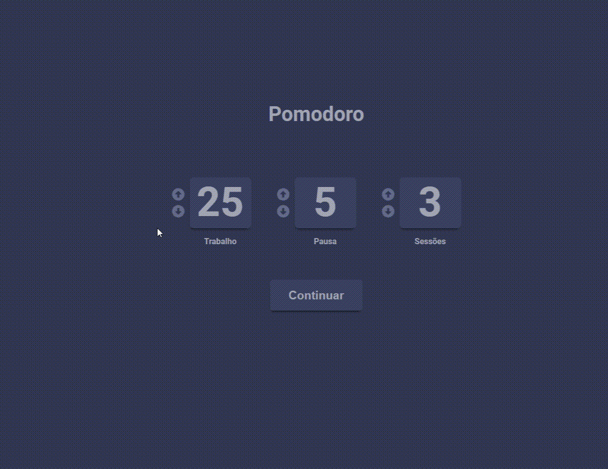

# GCB Test: Pomodoro



>  O projeto é um site que utiliza do método do Pomodoro.

Check the Application: https://pomodorowithreact.netlify.app/ <br>
## :page_facing_up: Explanation

O projeto foi desenvolvido a partir de um teste para a GCB, a qual tinha que desenvolver um site com a técnica do pomodoro.

A técnica consiste na utilização de um cronômetro para dividir o trabalho em períodos de 25 minutos, separados por breves intervalos.

O projeto inicia com uma tela que determina os tempos. Eles vêm com um padrão de 25 minutos de trabalho, 5 minutos de repouso e 3 sessões, porém o usuário pode alterar esses valores com as setas de incrementar (Para cima) e decrementar (Para baixo) ao lado. Observação: Não tem como deixar os valores negativos.

Após escolher o tempo, o usuário deve clicar no botão Continuar logo abaixo. Assim, será direcionado para o temporizador. 
Após o tempo de trabalho, soará um alarme e será direcionado para o tempo de pausa. Seguindo a mesma logica para o tempo de pausa, após o alarme o aplicativo irá identificar se ainda restam sessões, se sim, ele passa para a proxima sessão, se não ele irá 
redirecionar para a pagina inicial. 


## 📁 Pages

The site consists of X different pages:

- **Page 1: Pagina Home, aonde o usuario irá setar os valores.  
- **Page 2: Pagina de trabalho, aonde o contador de trabalho será iniciado.
- **Page 3: Pagina de Pausa, aonde o usuario irá tirar o tempo de pausa.


## :rocket: Technologies ##

The following tools were used in this project:

- [Html](https://developer.mozilla.org/pt-BR/docs/Web/HTML/Element/html/)  
- [CSS](https://developer.mozilla.org/pt-BR/docs/Web/CSS)  
- [JavaScript](https://developer.mozilla.org/pt-BR/docs/Web/JavaScript) 
- [React](https://pt-br.reactjs.org/)

## :closed_book: Requirements ##

Before starting :checkered_flag:, you need to have [Git](https://git-scm.com) and [Node](https://nodejs.org/en/) installed.

## :checkered_flag: Starting ##

```bash
# Clone this project
$ git clone https://github.com/ismaelgomesdasilva/pomodoroteste
# Access
$ cd teste-gcb
# Install dependencies
$ yarn or npm 
# Run the project
$ yarn start or npm start 
# The server will initialize in the <http://localhost:3000>
```

## 🤝 Collaborators

We thank the following people who contributed to this project:

<table>
  <tr>
    <td align="center">
      <a href="#">
        <br>
        <sub>
          <b>Ismael Gomes da Silva</b>
        </sub>
      </a>
    </td>
  </tr>
</table>

## 📝 License

This project is under license. See the [LICENSE](LICENSE.md) file for more details.

&#xa0;
